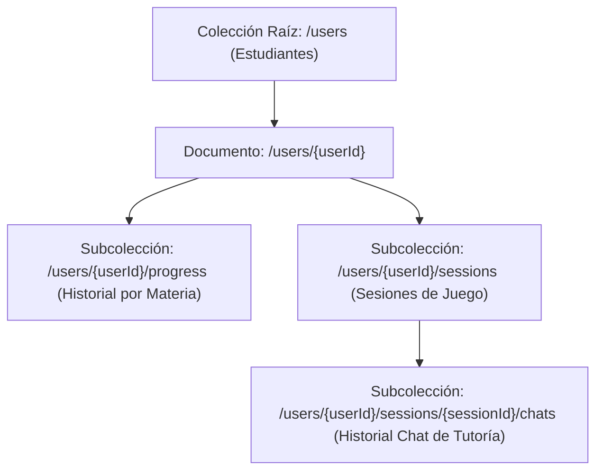

# Diseño de Base de Datos NoSQL — YACHAY AI (Firebase)

Este documento detalla el diseño de la base de datos NoSQL utilizando **Google Cloud Firestore** y **Firebase Storage** para el MVP de Yachay AI.

---

## 1. Arquitectura de Datos (NoSQL Firestore)

Firestore es una base de datos documental basada en **Colecciones** y **Documentos**. Para Yachay AI se propone una estructura híbrida de colecciones raíz y subcolecciones para garantizar un escalado eficiente, consultas rápidas y cumplimiento con la privacidad del estudiante.

### Diagrama de Colecciones


---

## 2. Definición de Colecciones y Esquemas JSON

### 2.1. Colección Raíz: `/users`
Almacena la información de perfil principal, puntos globales y logros desbloqueados por cada estudiante. El ID del documento (`userId`) corresponde al UID provisto por Firebase Authentication.

* **Estructura del Documento (`/users/{userId}`):**
```json
{
  "uid": "st_81726354",
  "name": "Inti Quispe",
  "avatarId": "avatar_condor",
  "totalPoints": 450,
  "achievements": [
    "first_login",
    "aymara_explorer",
    "math_champion"
  ],
  "createdAt": "2026-06-26T21:00:00Z",
  "lastActive": "2026-06-26T23:15:00Z"
}
```

* **Detalle de Campos:**
  | Campo | Tipo NoSQL | Descripción |
  | --- | --- | --- |
  | `uid` | String | Identificador único del estudiante. |
  | `name` | String | Nombre del niño/niña. |
  | `avatarId` | String | Nombre o ID del asset de avatar seleccionado (ej: `avatar_llama`). |
  | `totalPoints` | Integer | Puntos acumulados por completar lecciones. |
  | `achievements` | Array (String) | Lista de IDs de logros desbloqueados. |
  | `createdAt` | Timestamp | Fecha de registro del usuario. |
  | `lastActive` | Timestamp | Última actividad registrada del estudiante. |

---

### 2.2. Subcolección: `/users/{userId}/progress`
Registra el progreso específico del estudiante en cada materia. Permite conocer rápidamente el nivel actual (0-based) y el nivel máximo completado.

* **Estructura del Documento (`/users/{userId}/progress/{subjectId}`):**
  *(Los IDs de documentos `subjectId` recomendados son: `math`, `science`, `social`, `aymara`)*
```json
{
  "subjectId": "math",
  "currentLevel": 2,
  "maxLevelReached": 4,
  "completedLessonsCount": 3,
  "lastUpdated": "2026-06-26T22:30:00Z"
}
```

* **Detalle de Campos:**
  | Campo | Tipo NoSQL | Descripción |
  | --- | --- | --- |
  | `subjectId` | String | ID de la materia (coincide con el ID del documento). |
  | `currentLevel` | Integer | Nivel actual en el que se encuentra el niño (ej: nivel 2). |
  | `maxLevelReached` | Integer | Nivel histórico más alto alcanzado. |
  | `completedLessonsCount`| Integer | Cantidad de lecciones terminadas con éxito en esta materia. |
  | `lastUpdated` | Timestamp | Última fecha en que avanzó de nivel. |

---

### 2.3. Subcolección: `/users/{userId}/sessions`
Almacena el historial detallado de cada lección que el niño inicia. Esto sirve para reportar progreso, calcular tasas de acierto y alimentar el motor de aprendizaje adaptativo de Gemini.

* **Estructura del Documento (`/users/{userId}/sessions/{sessionId}`):**
```json
{
  "sessionId": "sess_991823",
  "subjectId": "aymara",
  "level": 0,
  "status": "completed",
  "correctAnswers": 4,
  "totalQuestions": 4,
  "pointsEarned": 50,
  "startedAt": "2026-06-26T23:10:00Z",
  "completedAt": "2026-06-26T23:14:00Z"
}
```

* **Detalle de Campos:**
  | Campo | Tipo NoSQL | Descripción |
  | --- | --- | --- |
  | `sessionId` | String | UUID de la sesión de juego. |
  | `subjectId` | String | Materia asociada. |
  | `level` | Integer | Nivel que está cursando. |
  | `status` | String | Estado de la lección (`in_progress`, `completed`, `abandoned`). |
  | `correctAnswers` | Integer | Número de respuestas correctas del estudiante. |
  | `totalQuestions` | Integer | Preguntas totales de la lección. |
  | `pointsEarned` | Integer | Puntos ganados en esta sesión específica. |
  | `startedAt` | Timestamp | Hora de inicio. |
  | `completedAt` | Timestamp | Hora de finalización. |

---

### 2.4. Subcolección: `/users/{userId}/sessions/{sessionId}/chats`
Guarda el registro de los mensajes intercambiados con el Tutor Socrático (Gemini) en las lecciones interactivas. Esto permite continuar el hilo de la conversación y dar seguimiento pedagógico.

* **Estructura del Documento (`/users/{userId}/sessions/{sessionId}/chats/{messageId}`):**
```json
{
  "text": "Jallalla significa ¡Viva! o ¡Que Viva! 🎉",
  "isUser": false,
  "type": "correct",
  "timestamp": "2026-06-26T23:12:00Z",
  "audioPath": null
}
```

* **Detalle de Campos:**
  | Campo | Tipo NoSQL | Descripción |
  | --- | --- | --- |
  | `text` | String | El texto del mensaje. |
  | `isUser` | Boolean | `true` si el mensaje fue enviado por el niño. `false` si es del Tutor Yachay. |
  | `type` | String | Tipo de mensaje de acuerdo al modelo de Flutter (`normal`, `correct`, `incorrect`, `hint`, `system`). |
  | `timestamp` | Timestamp | Fecha y hora exacta del envío. |
  | `audioPath` | String (Null) | URL o ruta de almacenamiento del audio si el estudiante respondió por voz (módulo de Aymara). |

---

## 3. Almacenamiento de Archivos (Firebase Storage)

Los archivos multimedia pesados (como las grabaciones de voz del estudiante `.wav` para la verificación fonética) no deben guardarse en Firestore. Deben subirse a **Firebase Storage** y vincularse mediante su URL.

### Estructura de Directorios en Storage
```text
/
├── avatars/
│   ├── avatar_llama.png
│   ├── avatar_condor.png
│   └── avatar_quirquincho.png
│
└── recordings/
    └── {userId}/
        └── {sessionId}/
            └── word_{wordIndex}_{timestamp}.wav
```

### Reglas de Almacenamiento
* Al terminar los 3 segundos de grabación de voz en Aymara, el archivo temporal local de Flutter se sube a: `/recordings/{userId}/{sessionId}/word_{wordIndex}.wav`.
* La URL pública o referencia de este archivo se registra en el campo `"audioPath"` de la subcolección de Chats para la validación fonética con la API multimodal de Gemini en el backend.

---

## 4. Reglas de Seguridad Recomendadas (Firebase Security Rules)

Para garantizar la seguridad de los datos de los niños, las reglas de Firestore deben impedir accesos no autorizados. Cada usuario autenticado solo puede leer y escribir sus propios datos.

```javascript
rules_version = '2';
service cloud.firestore {
  match /databases/{database}/documents {
    // Los usuarios solo pueden ver y editar sus propios perfiles y subcolecciones
    match /users/{userId} {
      allow read, write: if request.auth != null && request.auth.uid == userId;
      
      match /progress/{subjectId} {
        allow read, write: if request.auth != null && request.auth.uid == userId;
      }
      
      match /sessions/{sessionId} {
        allow read, write: if request.auth != null && request.auth.uid == userId;
        
        match /chats/{messageId} {
          allow read, write: if request.auth != null && request.auth.uid == userId;
        }
      }
    }
  }
}
```

---

## 5. Índices de Consulta Necesarios
Para que la aplicación Flutter funcione de forma rápida y optimizada, se deben configurar los siguientes índices compuestos en Cloud Firestore:

1. **Colección:** `/users/{userId}/sessions`
   * Campos indexados: `subjectId` (Ascendente) + `startedAt` (Descendente).
   * **Propósito:** Mostrar rápidamente el historial de las últimas lecciones del niño organizadas por materia.

2. **Colección:** `/users/{userId}/sessions/{sessionId}/chats`
   * Campos indexados: `timestamp` (Ascendente).
   * **Propósito:** Cargar la conversación del chat en orden cronológico correcto.
